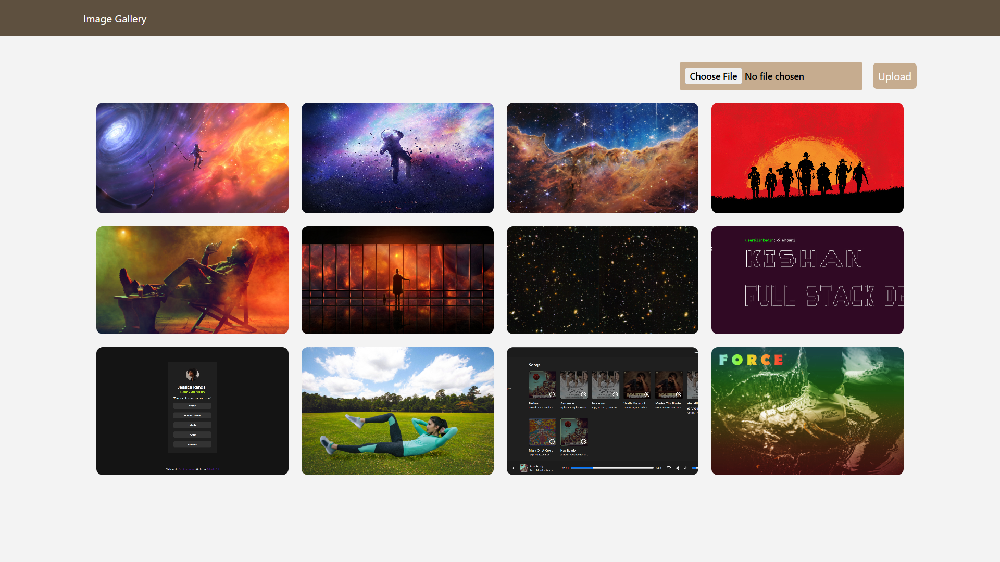

# Image Gallery



## Tools

1. Nodejs
2. Mongo DB
3. AWS SDK S3
4. React

## Install Dependencies

```js
yarn install
```

## Setup

Create a `.env.production` file and paste the contents below and replace actual values

```
PORT=5000
MONGO_URI=<mongo_uri>
BUCKET_NAME=<bucket_name>
BUCKET_REGION=<bucket_region>
ACCESS_KEY=<access_key>
SECRET_ACCESS_KEY=<secret_access_key>

ENABLE_CLOUD=true
```

### Build front end

```bash
cd client
yarn build
```

Start the server by executing `yarn start` in project root directory

```bash
$image-gallery: yarn start
```

Visit `http://localhost:5000` to view the image gallery
